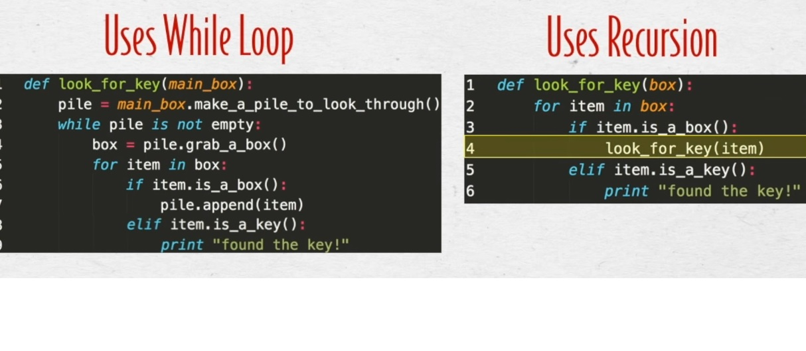

# DSA- Data Structures and Algorithms

## Videos
- [Basic Recursion video](https://www.youtube.com/watch?v=vPEJSJMg4jY)

- [Data Structures in 15 min](https://www.youtube.com/watch?v=sVxBVvlnJsM)
- [BigO Explained](https://www.youtube.com/watch?v=v4cd1O4zkGw)
## Readings
- [Basic Data Structures](https://towardsdatascience.com/8-common-data-structures-every-programmer-must-know-171acf6a1a42)
- [Why Big O](https://web.archive.org/web/20230207075759/https://triplebyte.com/blog/why-you-should-learn-big-o-and-stop-hacking-your-way-through-algorithms)

# What is 1 of the more important things you should consider when deciding which data structure is best suited to solve a particular problem?
- Big O notation (Algorithmic Efficiency). This helps you decide which data structure to use. 
Here is a list of data structures to be used:
1. Linked lists
2. Array
3. Hash Table (dictionary in python, object in JS)
4. Stack Queue
5. Graphs + Trees

# How can we ensure that we’ll avoid an infinite recursive call stack?
- While loops are easier for performance, and recursion is cleaner and is easier to understand
- Base Case is when the function doesnt call itself again and Recursive Case calls itself
- Ctrl + C to escape the throws of death-loops

1. Base Case:
```  def countdown(i):
      print i
      #base case
      if i <= 1:
        return
      #recursive case
      else:
        countdown(i-1)
```
2. Recursive Case (infite loop):
```
  def countdown(i):
    print i
    countdown(i-1)
```


## Things I want to know more about
Use cases for each type of data structure and how to identify effectively when/which to use.