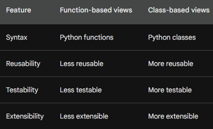

# Django CRUD and Forms

## How do Django Forms facilitate user input handling, and what are some key components of creating a form using the Django framework?

- Defining the form: The first step is to define the form by creating a class that inherits from django.forms.Form. This class will define the fields that will be included in the form, as well as the validation rules that will be applied to the user input.
- Validating user input: Django Forms provide a number of built-in validation rules that can be used to validate user input. For example, you can use the required rule to ensure that a field is not empty, or the min_length rule to ensure that a field is at least a certain length.
- Processing form submissions: When a user submits a form, Django Forms will automatically validate the user input and raise an exception if any of the validation rules are not met. If the user input is valid, Django Forms will process the form submission and take the appropriate action.

## Explain the purpose of Django Templates in web development and describe how template inheritance can be utilized to improve code reusability and maintainability.

Templates are essentially HTML documents that are enhanced with Django's template language. This language allows you to insert dynamic content into your templates, such as the results of database queries or the values of form fields.

Template inheritance is a feature of Django Templates that allows you to reuse code across multiple templates. This can help you to keep your templates DRY (Don't Repeat Yourself) and improve their maintainability.

To use template inheritance, you create a base template that contains the common code for all of your templates. Then, you create child templates that inherit from the base template. The child templates can override the base template's code or extend it with new code.

## Describe the function of Django Views in handling HTTP requests, and outline the differences between function-based views and class-based views.
Django views are Python functions or classes that receive a web request and return a web response. They are the central part of the Django web framework, and they are responsible for handling all of the HTTP requests that come into your application.

## Things I want to know more about
[this](https://developer.mozilla.org/en-US/docs/Learn/Server-side/Django/Home_page)