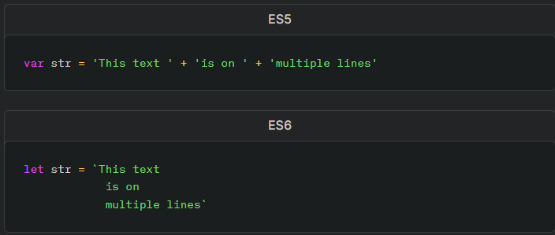

## In the context of ES6 Syntax and Feature Overview, what are three key features introduced in ES6 that improve upon the previous version of JavaScript, and briefly explain their benefits?

- multi-line strings: Using template literal syntax, a JavaScript string can span multiple lines without the need for concatenation. 


- implicit returns: The **`return`** keyword is implied and can be omitted if using arrow functions without a block body.


- concatenation/string interpolation: Expressions can be embedded in template literal strings.

## After reading “Tailwind in 15 minutes,” can you describe the purpose of utility classes in Tailwind CSS and provide an example of how to use them to style an HTML element?

One of the benefits of using utility classes is that they are very easy to learn and use. Each class has a descriptive name that tells you what it does, so you can quickly figure out which classes you need to use to style your elements. Utility classes are very lightweight, so they don't add a lot of bloat to your CSS.
Ex:
```
<div class="bg-red-500 text-white p-4 rounded-lg">
  This is a styled element using Tailwind CSS utility classes.
</div>

```

## Based on “Why to use Next.js,” explain the main advantages of using Next.js for web development, and provide a brief comparison between traditional client-side rendering and Next.js’s server-side rendering approach

**Next.js's server-side rendering (SSR) approach:**  renders the React components on the server-side, which means that the browser only has to download the HTML, CSS, and static assets. This can lead to much faster initial load times, even for large applications.

**Scalability:** Next.js is designed to be scalable, so you can easily add more traffic to your website without having to worry about performance.

**Performance:** Next.js uses a variety of techniques to improve the performance of web applications, including server-side rendering (SSR), static site generation (SSG), and code splitting. This can lead to significant improvements in page load times, which can improve the user experience and boost SEO rankings.


## things i wanna learn mo aboot
this thing called JavaScript and why it exists and why we look at it... `;)`