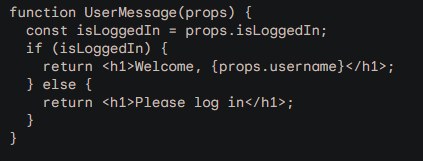

# React 2... from the graveyard

## How does lifting state up in a React application help with managing data flow and what are the benefits of using this approach?

 Lifting state up is a pattern in React that involves moving state from child components to their parent component. This can be helpful for managing data flow in a React application, as it ensures that all of the components that need to access a particular piece of state have access to it.
 - helps keep code DRY
 - improve performance
 - improve readability

## Explain the concept of conditional rendering in React and provide an example of how to implement it in a component.

Conditional rendering in React is the ability to render different UI elements based on a condition. This can be useful for a variety of purposes, such as showing or hiding elements, displaying different content based on user input, or implementing permission levels.

## What are the main principles behind “Thinking in React” and how do they guide the process of designing and building a React application?

Thinking in React is a set of principles that can help you design and build React applications that are maintainable, scalable, and easy to understand.

- think in components
- think about state
- think about data flow
- think about performance

These principles can guide the process of designing and building a React application in a number of ways. For example, by thinking in components, you can break down your application into smaller, more manageable pieces. This can make it easier to develop and test your application, and it can also make it easier to maintain your application in the future.

### useful
[thinking react..fuly?](https://react.dev/learn/thinking-in-react)

[react guide](https://tylermcginnis.com/reactjs-tutorial-a-comprehensive-guide-to-building-apps-with-react/)

## things I wanna know mo boot
how implementing react vs. mui with django would go with a threejs project