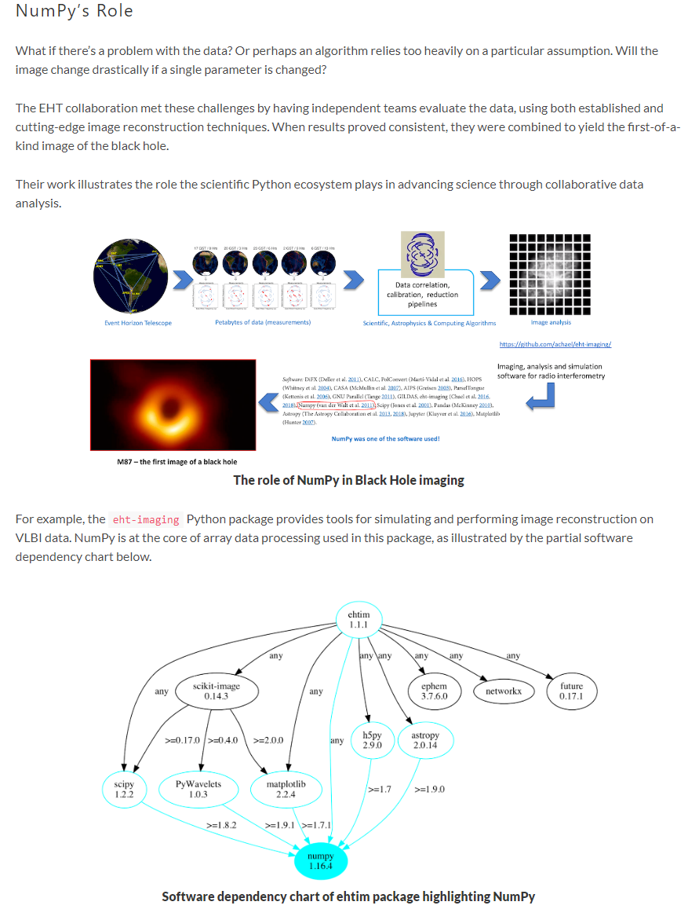

# Data Analysis
### Readings
- [What is Jupyter Lab](https://jupyterlab.readthedocs.io/en/stable/getting_started/overview.html)
- [Numpy Tutorial](https://www.dataquest.io/blog/numpy-tutorial-python/)
- [Numpy Arrays](https://www.tutorialspoint.com/numpy/index.htm)

## Questions
1. What are the key features and benefits of Jupyter Lab, and how does it differ from Jupyter Notebook?
    While JupyterLab builds upon the Jupyter Notebook foundation, it provides a more comprehensive and versatile environment    for interactive computing. Jupyter Notebook primarily focuses on creating and editing notebooks, while JupyterLab extends   this functionality by incorporating multiple file formats, a more flexible user interface, and a broader range of tools    for an enhanced coding experience. JupyterLab is often considered as the next-generation interface for Jupyter notebooks,   offering greater flexibility and productivity to users.
    Key Features:
    - Enhanced user interface
    - Multiple document and file formats
    - Integrated code editors
    - Flexible layout and panes
    - Extension ecosystem
    - Integrated terminal
    - Improved file and directory navigation

2. What are the main functionalities provided by the NumPy library, and how can it be useful in Python programming, particularly for scientific computing and data manipulation tasks?
    NumPy is a fundamental library for scientific computing and data manipulation in Python. Its efficient array operations,    advanced indexing techniques, and integration with other scientific libraries make it a cornerstone of many data analysis   workflows. Whether you're working with numerical simulations, data analysis, machine learning, or signal processing, NumPy     provides essential tools and performance optimizations that enhance productivity and speed up computations.


3. Explain the basic structure and properties of NumPy arrays, and provide examples of how to create, manipulate, and perform operations on them.

    The basic structure of NumPy arrays is the ndarray (n-dimensional array) object. It represents a grid of values of the same data type, indexed by non-negative integers. Here are the key properties and examples of creating, manipulating, and performing operations on NumPy arrays:
    #### Creation, Manipulation and Operations on NumPy arrays
- Creation
    ```import numpy as np

        my_list = [1, 2, 3, 4, 5]
        my_array = np.array(my_list)
        print(my_array)
        # Output: [1 2 3 4 5]```
- Manipulation
   ```my_array = np.array([1, 2, 3, 4, 5, 6])
      reshaped_array = my_array.reshape((2, 3))  # 2 rows, 3 columns
      print(reshaped_array)
      # Output:
      # [[1 2 3]
      #  [4 5 6]]```
- Operations
    ```array1 = np.array([1, 2, 3])
       array2 = np.array([4, 5, 6])
       
       sum_array = array1 + array2
       print(sum_array)
       # Output: [5 7 9]
       
       product_array = array1 * array2
       print(product_array)
       # Output: [4 10 18]


## Things I want to know more about
NumPy's implementation for helping capture the first pictures of a black hole
